# FlightOS

FlightOS is an autopilot and stabilization control suite designed for aerostatic ships built with Valkyrien Skies and Create. It provides active roll/pitch leveling, smooth trajectory control, and wireless remote control via a handheld pocket terminal.

---

## Installation

### Primary Ship Computer
Run the following command on the central ship computer terminal:
<!-- SHIP_INSTALL -->`pastebin run Lqw9a5mh`<!-- /SHIP_INSTALL -->

### Remote Pocket Tablet
Run the following command on the pocket computer (requires a wireless Ender Modem):
<!-- TABLET_INSTALL -->`pastebin run tvUMD02v`<!-- /TABLET_INSTALL -->

---

## GPS System Requirements

To navigate using the autopilot, your Minecraft world must have an active GPS host constellation. 

For detailed step-by-step instructions on setting up GPS host computers, please refer to the official [CC:Tweaked GPS Setup Guide](https://tweaked.cc/guide/gps_setup.html).

---

## User Control Interface

### Dashboard
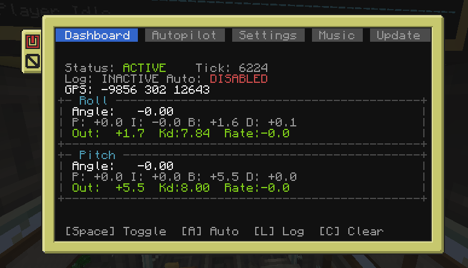
The main screen displays real-time ship pitch and roll angles, global coordinates, active system states, and individual engine outputs.

### Autopilot Configuration
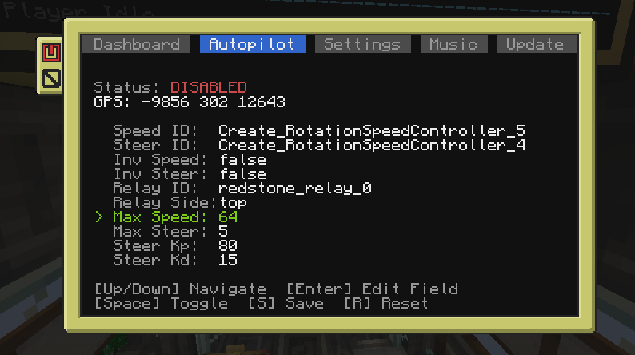
Enter target coordinates, monitor distance to the destination, and configure autopilot-specific tuning constants.

### System Settings
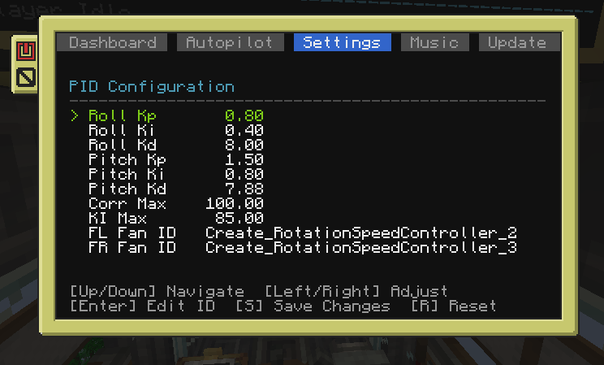
Manage peripheral associations, adjust display options, invert motor rotations, and toggle diagnostic configurations.

Below are the details for each configuration setting:
* **Roll Kp / Ki / Kd**: Proportional, Integral, and Derivative coefficients controlling stabilization around the roll (left-to-right tilt) axis.
* **Pitch Kp / Ki / Kd**: Proportional, Integral, and Derivative coefficients controlling stabilization around the pitch (front-to-back tilt) axis.
* **Corr Max**: The maximum allowable engine thrust adjustment speed (in RPM) used by the PID loops. Clamping this prevents over-violent engine responses.
* **Ki Max**: The maximum limit for the Integral error accumulator. Prevents "integral windup" where errors accumulate infinitely during persistent tilts.
* **FL / FR / BL / BR Fan ID**: Network names of the Create Rotation Speed Controllers corresponding to Front-Left, Front-Right, Back-Left, and Back-Right stabilization bearings. Press **Enter** to edit the peripheral ID.

Press **S** to save modifications permanently or **R** to reset to last saved defaults.

### Audio Subsystem
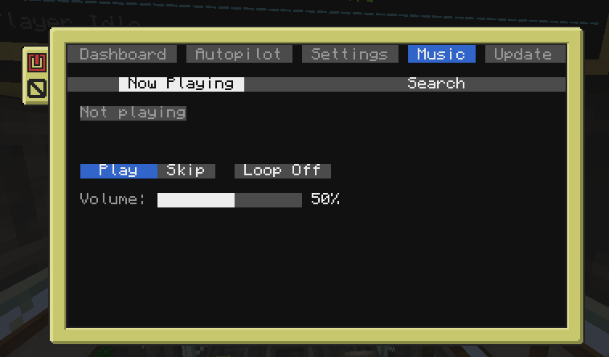
Search and stream audio through the ship's speaker network. Use the sub-tabs to switch between active playback controls and search.

### System Updates
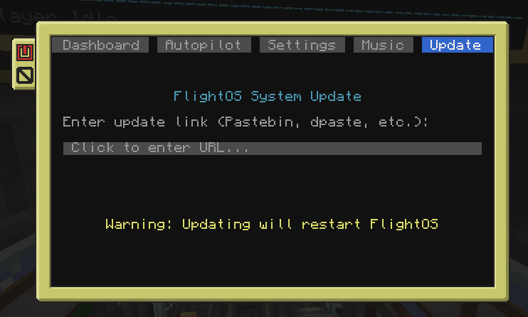
Paste a new update URL and press Enter to automatically download, install, and reboot the operating system.

### Telemetry HUD
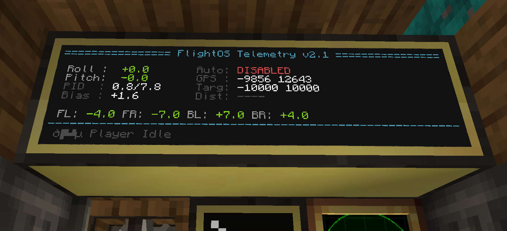
An external split-screen monitor layout designed for the cockpit, displaying steering status, progress bars, and diagnostics.

---

## Flight Mechanics & PID Tuning Guide

FlightOS uses closed-loop Proportional-Integral-Derivative (PID) controllers to maintain ship level and control flight paths. You can modify these coefficients in the Settings and Autopilot screens to match the size, weight, and engine placement of your ship.

### 1. Stabilization Tuning (Roll & Pitch)

If the ship is unstable, tilts, or oscillates, adjust the stabilization PID constants:

* **Kp (Proportional Gain)**: Controls reaction speed.
  * *Purpose*: The primary force that pulls the ship back to level.
  * *Tuning*: Increase Kp if the ship takes too long to recover from a tilt. If Kp is too high, the ship will shake or oscillate rapidly.
* **Ki (Integral Gain)**: Corrects constant imbalance.
  * *Purpose*: Adjusts for weight distribution (e.g., if one side of your ship has heavier blocks and constantly leans).
  * *Tuning*: Increase Ki slowly if the ship stabilizes but remains slightly tilted to one side. If Ki is too high, it will cause slow, wide oscillations.
* **Kd (Derivative Gain)**: Dampens movement (Braking).
  * *Purpose*: Slows down the tilt correction as the ship approaches level, preventing it from overshooting.
  * *Tuning*: Increase Kd if the ship swings past the level position when trying to stabilize. If Kd is too high, the ship's movements will feel sluggish.

### 2. Autopilot Steering Tuning (Steer Kp & Kd)

If the autopilot flies crookedly, makes wide turns, or fails to fly in a straight line:

* **Steer Kp**: Adjusts steering aggressiveness.
  * *Purpose*: Determines how fast the rudder turns when the ship is off-course.
  * *Tuning*: Increase Steer Kp if the ship turns too slowly towards the target. Decrease it if the ship steers too aggressively and over-corrects.
* **Steer Kd**: Dampens heading adjustments.
  * *Purpose*: Slows down the steering rate as the ship's heading aligns with the target vector, preventing course overshooting.
  * *Tuning*: Increase Steer Kd if the ship flies past the straight line vector when completing a turn.

---

## Troubleshooting: Motor Inversion Detection

If the ship instantly flips over, spins, or rolls violently out of control the moment you toggle stabilization ON, it means one or more of your four corner motors are rotating in the wrong direction (inverted thrust).

### How to Detect Inverted Motors Using Tablet Test
1. Access the **Ctrl** tab on your handheld tablet.
2. Press the **T** key (or **E** in Russian layout) to trigger **Test Motors** mode.
3. The stabilization system will automatically turn OFF, and a sequential testing routine will begin:
   * **FL (Front-Left)**, **FR (Front-Right)**, **BL (Back-Left)**, and **BR (Back-Right)** motors will be tested one by one.
   * Before each motor spins, the tablet will display a 3-second countdown (e.g., `FL Fan prep: 3s`). This gives you time to walk over to the active corner.
   * The active motor will spin at +45 RPM for 3 seconds (`FL Fan active!`).
4. Stand next to the active engine during its 3-second spin phase:
   * Verify that the physical propeller is pushing air **downwards** to lift the ship.
   * If the active propeller blows air **upwards** (pulling the ship down) while its test phase is active, that motor is physically inverted.

### How to Correct the Inversion
* Use a **Create Wrench** to right-click the inverted **Rotation Speed Controller** block and change its target direction (e.g., invert the dial setting from positive to negative, or vice-versa).
* Alternatively, reverse the gear rotation or flip the mechanical bearing orientation in the physical engine assembly.
* Once corrected, positive RPM output from the computer must always generate downward thrust.

---

## Physical Installation Reference

### Stabilization Engines
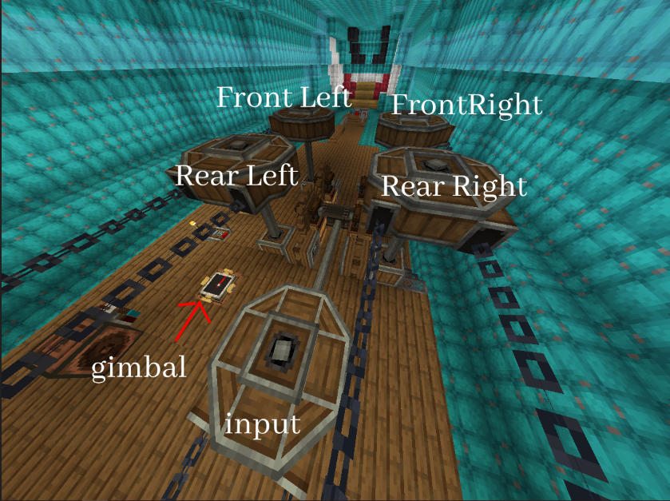
The stabilization loops control four mechanical bearings positioned at the front-left, front-right, back-left, and back-right corners of the ship.

### Steering Gears
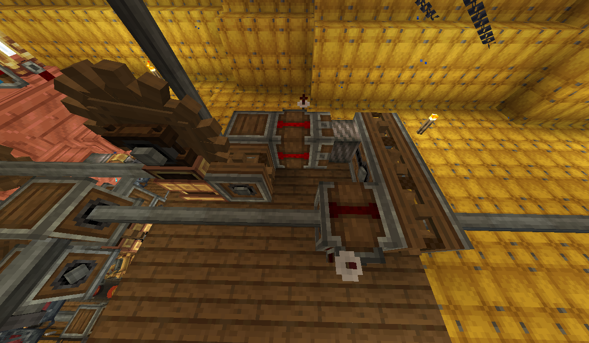
The rudder bearing assembly automatically centers itself. Autopilot commands are delivered via pulsed speed controls.

### Throttle & Propulsion
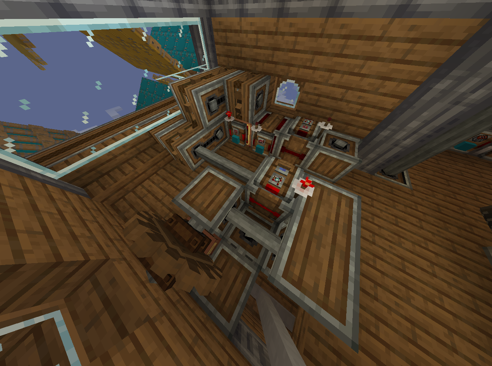
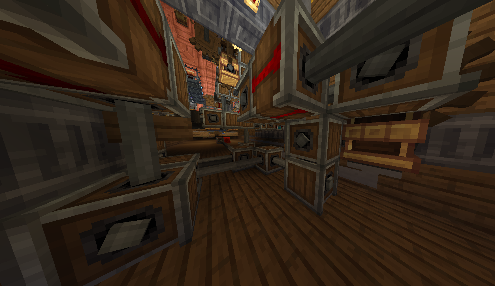
The primary propulsion drives are regulated through variable mechanical speed controllers, permitting cruise speeds and reverse braking.

### System Cabling
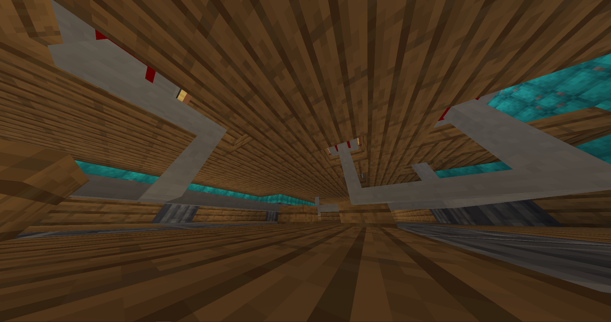
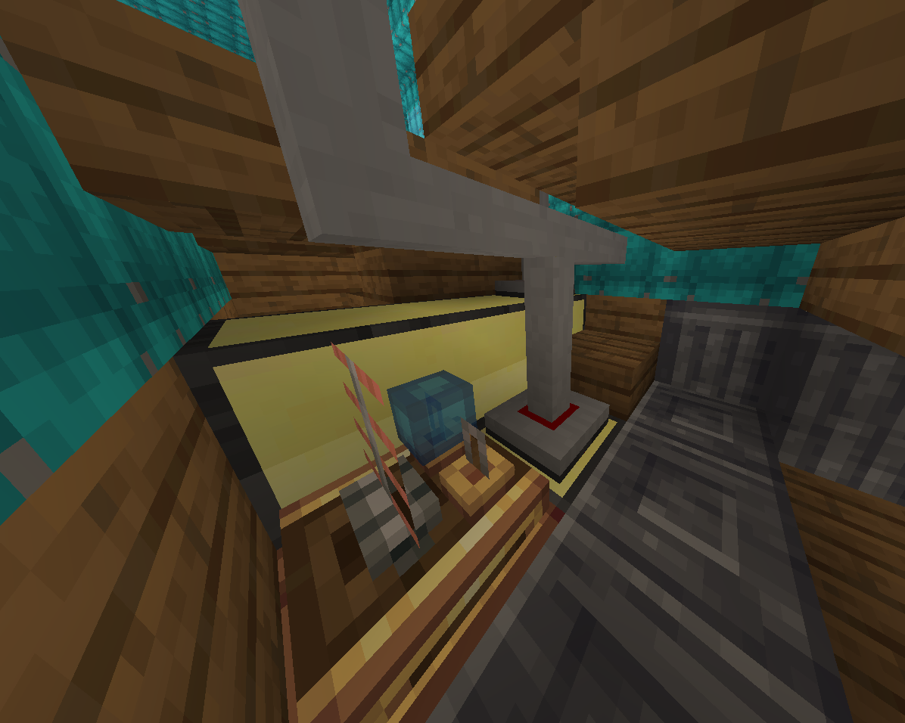
All motors, monitors, and modems must be networked back to the central ship computer.

### Autopilot Interrupt Relay
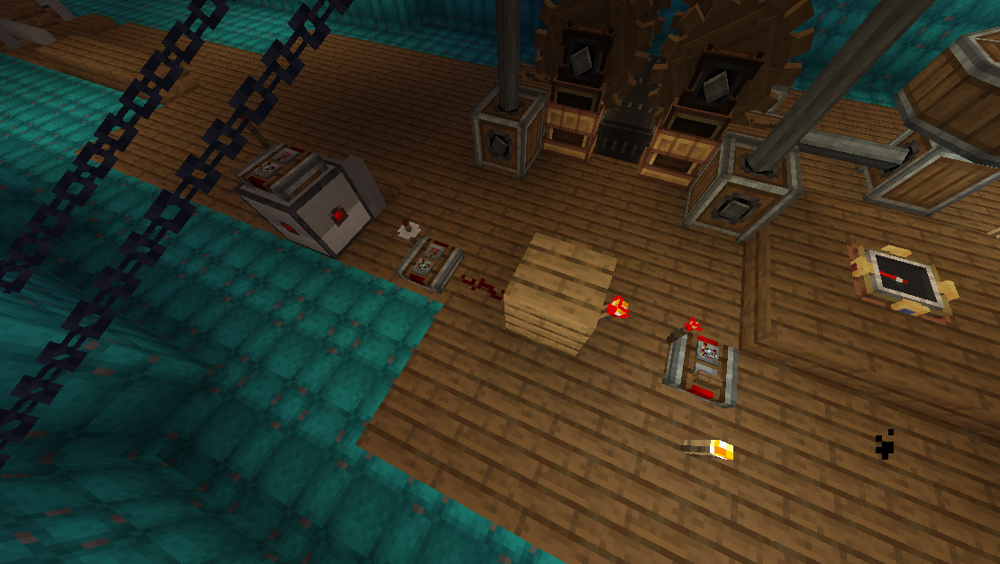
A redstone relay allows pilots to manually disable the autopilot system instantly from the captain's chair.

---

## Credits & References

The integrated streaming audio capability of the FlightOS Music subsystem is built upon the implementation from [computercraft-streaming-music](https://github.com/terreng/computercraft-streaming-music).

